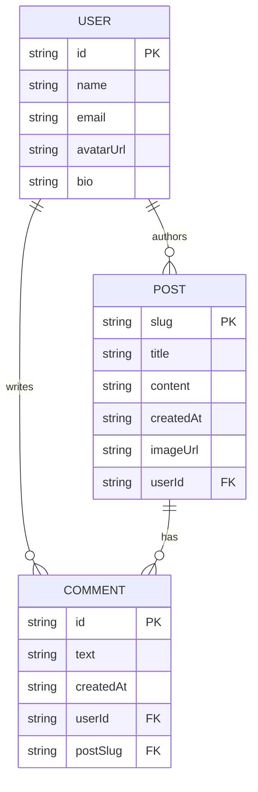
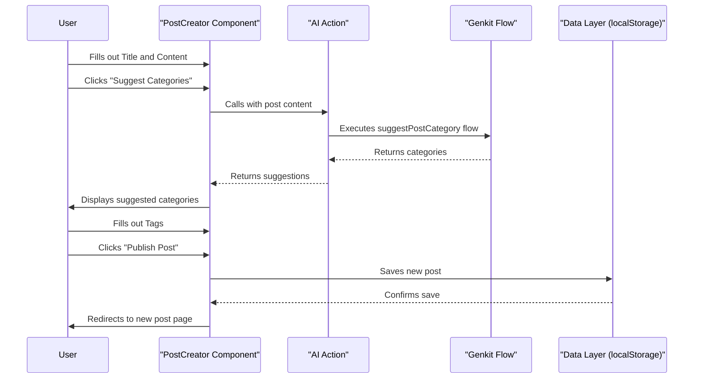

# BlogIn: Developer Documentation

This document provides a comprehensive overview of the BlogIn application, from setup and architecture to codebase navigation and contribution guidelines.

## 1. Overview

BlogIn is a feature-rich, modern blogging platform built with Next.js, React, and Google's Genkit. It provides a clean, intuitive interface for writers to create and share their stories, and for readers to discover, engage with, and follow their favorite authors.

### 1.1. Key Features

- **User Authentication**: Secure sign-up and login functionality.
- **Profile Management**: Users can create and edit their profiles, including name, bio, and avatar.
- **Post Creation & Editing**: A rich text editor allows users to write, edit, and publish posts with markdown-style formatting.
- **AI-Powered Suggestions**: Utilizes Genkit to provide AI-driven category suggestions for new posts based on their content.
- **Interactive Feed**: A dynamic homepage that displays all posts and allows filtering by tags.
- **Post Interaction**: Users can like, save (bookmark), and comment on posts.
- **User Profiles**: Comprehensive profile pages that display a user's posts, comments, likes, saved posts, followers, and following lists.
- **Social Features**: Users can follow and unfollow other authors.
- **Global Search**: A powerful command menu (`Cmd+K` or `Ctrl+K`) to search for posts, users, and topics.
- **Theming**: Light and dark mode support.

## 2. Getting Started

### 2.1. Installation

First, install the project dependencies using npm:

```bash
npm install
```

### 2.2. Running the Development Server

To start the development server, run the following command:

```bash
npm run dev
```

The application will be available at `http://localhost:9002`.

### 2.3. Building for Production

To create a production build, run:

```bash
npm run build
```

After building, start the production server with:

```bash
npm run start
```

### 2.4. Available Scripts

- `npm run lint`: Lints the code to check for quality and style issues.
- `npm run typecheck`: Runs the TypeScript compiler to check for type errors.
- `npm run genkit:dev`: Starts the Genkit development server.
- `npm run genkit:watch`: Starts the Genkit development server in watch mode.

## 3. Architecture

### 3.1. Tech Stack

- **Framework**: [Next.js](https://nextjs.org/) (App Router)
- **Language**: [TypeScript](https://www.typescriptlang.org/)
- **Styling**: [Tailwind CSS](https://tailwindcss.com/)
- **UI Components**: [ShadCN UI](https://ui.shadcn.com/)
- **Generative AI**: [Genkit](https://firebase.google.com/docs/genkit)
- **Forms**: [React Hook Form](https://react-hook-form.com/) & [Zod](https://zod.dev/)

### 3.2. System Architecture

This diagram illustrates the high-level architecture, showing the main components and their dependencies.

```mermaid
componentDiagram
    package "Browser" {
        [Next.js Frontend]
    }

    package "Server" {
        [Genkit AI Flows]
    }

    database "LocalStorage" {
        [Data Simulation]
    }

    [Next.js Frontend] --> [Genkit AI Flows] : Calls AI for suggestions
    [Next.js Frontend] --> [Data Simulation] : Reads/Writes Data
```

### 3.3. Project Structure

The project follows a standard Next.js `src` directory structure:

- `src/app`: Application routes.
- `src/components`: Reusable React components.
- `src/hooks`: Custom React hooks.
- `src/lib`: Core business logic, data fetching, and utilities.
- `src/ai`: Genkit AI flows.
- `public`: Static assets.

### 3.4. Data Simulation

The application uses `localStorage` to simulate a database (`src/lib/data.ts`), allowing for a fully interactive experience without a backend.

## 4. Codebase Deep Dive

### 4.1. Implementation Patterns

- **Rendering**: The app uses a mix of React Server Components (RSC) and Client Components.
- **Data Fetching**: Primarily done in Server Components via functions in `src/lib/data.ts`.
- **State Management**: Client-side state is managed with React hooks and custom hooks.

### 42. User Interactions

This diagram shows the primary actors and their interactions with the system.

```mermaid
graph TD
    A(User) --> (Sign Up)
    A --> (Log In)
    A --> (Log Out)
    A --> (View Posts)
    A --> (Search)

    subgraph "Authenticated User"
        A --> (Create Post)
        A --> (Edit Post)
        A --> (Comment on Post)
        A --> (Like Post)
        A --> (Save Post)
        A --> (Follow User)
        A --> (Edit Profile)
    end

    (Create Post) --> (Get AI Category Suggestions)
```

### 4.3. Data Model (ERD)

This ERD illustrates the data model for the application.



### 4.4. Codebase Navigation Examples

#### Creating a New Post

This diagram details the process of a user creating a new blog post.



## 5. Contributing

### 5.1. Adding a New Feature

1.  **Update the Data Model**: Modify types in `src/lib/types.ts`.
2.  **Add a Data Manipulation Function**: Add a function to `src/lib/data.ts`.
3.  **Create a Server Action** (Optional): In `src/lib/actions.ts` for client-side triggers.
4.  **Create a New UI Component**: In `src/components`.
5.  **Integrate the New Component**: Add the new component to a page in `src/app`.

### 5.2. Code Style and Conventions

- **Styling**: Use Tailwind CSS utility classes.
- **UI Components**: Use Shadcn/ui components from `src/components/ui`.
- **Linting**: Run `npm run lint` before committing.
- **Type Checking**: Run `npm run typecheck` before committing.
