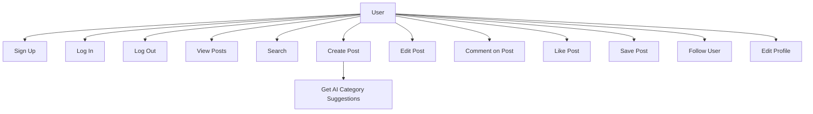
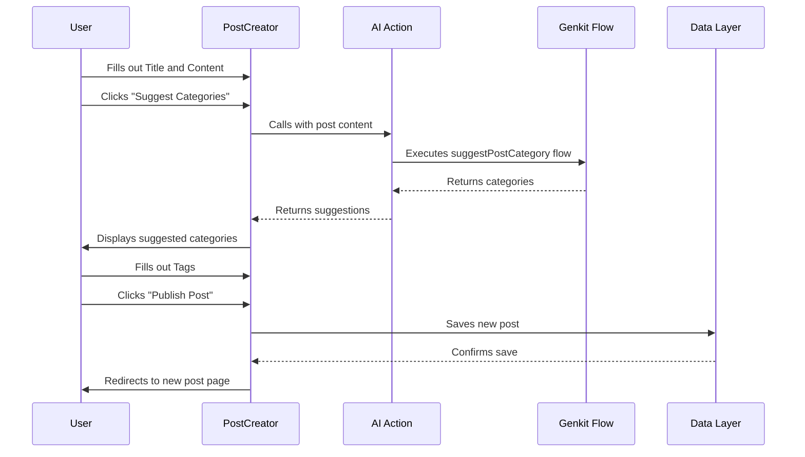
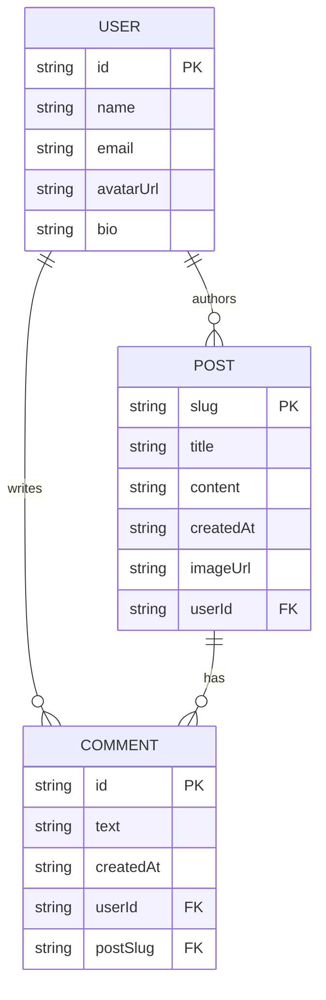

# BlogIn: UML Diagrams

This document provides a set of UML diagrams to illustrate the architecture, user interactions, and data model of the BlogIn application.

## Use Case Diagram

**Description:** This diagram shows the primary actors (User) and their interactions with the system's main features (use cases). It provides a high-level overview of the functionalities available in the application.



## Component Diagram

**Description:** This diagram illustrates the high-level architecture of the application, showing the main components and their dependencies. It highlights the separation between the frontend UI, the AI services, and the simulated data layer.

```mermaid
componentDiagram
    [Next.js Frontend] --> [Genkit AI Flows] : Calls AI for suggestions
    [Next.js Frontend] --> [Data Simulation] : Reads/Writes Data
```

## Sequence Diagram: Create a New Post

**Description:** This sequence diagram details the step-by-step process of a user creating a new blog post. It shows the interactions between the user, the React components, the AI flow for category suggestions, and the data layer.



## Entity-Relationship Diagram (ERD)

**Description:** This ERD illustrates the data model for the application. It defines the core entities (User, Post, Comment) and the relationships between them, such as a user authoring multiple posts or posts having multiple comments.


